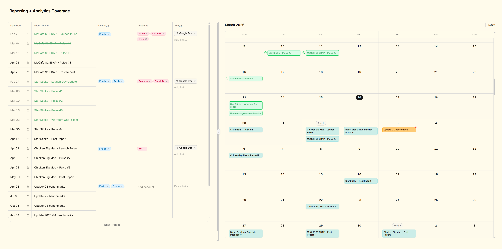

<h1 align="center">📊 Reporting + Analytics Coverage</h1>

<p align="center">
  <strong>The IA team's project management tool for tracking every report, deadline, and deliverable — so nothing slips through the cracks.</strong>
</p>

<p align="center">
  
  
  
  
  
  
  
</p>

<p align="center">
  <a href="https://ia-coverage.vercel.app/">Live App →</a>
</p>

<div align="center">
  
</div>

---

## What is this?

Before this tool existed, the Insights & Analytics (IA) team was juggling reporting deadlines across a tangled Google Sheets setup — opening a dozen links just to understand the scope of a single project. It wasn't sustainable.

**Reporting + Analytics Coverage** replaces all of that with a single, purpose-built interface. It's a lightweight, text-first project management tool where every report the team is responsible for lives in one place — with its due date, owners, requesters, linked resources, and internal notes all visible at a glance.

The tool is split into two views: a **table** for managing and editing, and a **calendar** for seeing what's due and what's coming up.

> **Note:** This is an internal tool built exclusively for the IA team. It is not open-source and is not accepting contributions at this time.

---

## Features

### 📋 Table View
- **Add projects with one or many reports** — Group multiple deliverables under a single project, or create standalone entries
- **Inline editing** — Due dates, report names, owners, requesters, and linked files are all editable directly in the table
- **Name & link badges** — Tag team members as owners or account contacts with badge-style inputs; attach pertinent links as clickable badges
- **Internal notes** — Leave thoughts, context, or reminders on any report via a built-in note editor
- **Completion tracking** — Mark individual reports as complete with a single click
- **Archive & unarchive** — Archive finished reports (or entire projects) to keep the table clean; archived items collapse into a separate section below
- **Delete reports** — Remove entries you no longer need
- **Resizable columns** — Drag column borders to customize your layout

### 📅 Calendar View
- **Monthly calendar** — See all upcoming and past-due reports laid out by date
- **Report popovers** — Click any report on the calendar to see its full details (owners, accounts, links, notes) in a popover — no navigation required
- **Color coding** — Assign custom colors to reports for quick visual identification
- **Complete, archive, and unarchive** — All key actions are available directly from the calendar view too

### 🔔 Notifications
- Lightweight toast notifications (via Sonner) for key actions like saving, archiving, and completing reports

---

## Architecture

```
┌─────────────────────────────────────────────────────────┐
│                        Vercel                           │
│                     (Deployment)                        │
├─────────────────────────────────────────────────────────┤
│                                                         │
│   ┌───────────────────────────────────────────────┐     │
│   │              Next.js 16 App                   │     │
│   │          (React 19 + TypeScript)              │     │
│   │                                               │     │
│   │  ┌──────────────┐     ┌──────────────────┐    │     │
│   │  │ Table View   │     │  Calendar View   │    │     │
│   │  │              │     │                  │    │     │
│   │  │ project-table│     │ month-calendar   │    │     │
│   │  │ report-row   │     │ calendar-day     │    │     │
│   │  │ archived-tbl │     │ calendar-badge   │    │     │
│   │  │ merged-cell  │     │ report-detail-   │    │     │
│   │  │              │     │   popover        │    │     │
│   │  └──────┬───────┘     └───────┬──────────┘    │     │
│   │         │                     │               │     │
│   │         └──────────┬──────────┘               │     │
│   │                    │                          │     │
│   │         ┌──────────▼──────────┐               │     │
│   │         │   Shared Actions    │               │     │
│   │         │                     │               │     │
│   │         │ report-actions      │               │     │
│   │         │ note-editor         │               │     │
│   │         │ add-reports-form    │               │     │
│   │         │ new-project-popover │               │     │
│   │         │ completion-circle   │               │     │
│   │         └──────────┬──────────┘               │     │
│   │                    │                          │     │
│   │         ┌──────────▼──────────┐               │     │
│   │         │     lib / hooks     │               │     │
│   │         │                     │               │     │
│   │         │ data-context (React │               │     │
│   │         │   Context for       │               │     │
│   │         │   global state)     │               │     │
│   │         │ use-report-         │               │     │
│   │         │   operations        │               │     │
│   │         │ use-suggestions     │               │     │
│   │         │ use-column-resize   │               │     │
│   │         │ colors / format-link│               │     │
│   │         └──────────┬──────────┘               │     │
│   │                    │                          │     │
│   └────────────────────┼──────────────────────────┘     │
│                        │                                │
├────────────────────────┼────────────────────────────────┤
│                        ▼                                │
│            ┌───────────────────────┐                    │
│            │   Supabase Client     │                    │
│            │   (supabase.ts)       │                    │
│            └───────────┬───────────┘                    │
│                        │                                │
└────────────────────────┼────────────────────────────────┘
                         │
                         ▼
              ┌─────────────────────┐
              │  Supabase (Hosted)  │
              │                     │
              │   PostgreSQL DB     │
              │   Reports table     │
              └─────────────────────┘
```

**In plain English:** The app is a single Next.js project deployed on Vercel. React Context (`data-context.tsx`) acts as the global state layer, feeding report data to both the table and calendar views. All CRUD operations go through a custom `use-report-operations` hook which talks to a hosted Supabase PostgreSQL database via the Supabase JS client. There's no separate backend — the Supabase client handles everything directly from the frontend.

---

## Tech Stack

| Layer        | Technology                                                                 |
|:-------------|:---------------------------------------------------------------------------|
| Framework    | [Next.js 16](https://nextjs.org/) (App Router)                            |
| UI Library   | [React 19](https://react.dev/)                                            |
| Language     | [TypeScript](https://www.typescriptlang.org/)                             |
| Styling      | [Tailwind CSS 4](https://tailwindcss.com/)                                |
| Components   | [shadcn/ui](https://ui.shadcn.com/) (Badge, Button, Calendar, Input, Popover, Resizable, Sonner) |
| Icons        | [Lucide React](https://lucide.dev/)                                       |
| Database     | [Supabase](https://supabase.com/) (Hosted PostgreSQL)                     |
| State        | React Context API                                                         |
| Deployment   | [Vercel](https://vercel.com/)                                             |

---

## Project Structure

```
src/
├── app/
│   ├── layout.tsx              # Root layout
│   ├── page.tsx                # Main page (table + calendar)
│   ├── globals.css             # Global styles
│   └── favicon.ico
│
├── components/
│   ├── app-header.tsx          # App title bar
│   ├── project-table.tsx       # Table view — main project/report table
│   ├── report-row.tsx          # Individual report row in the table
│   ├── merged-cell.tsx         # Grouped cell for multi-report projects
│   ├── archived-table.tsx      # Collapsed archived reports section
│   ├── add-reports-form.tsx    # Form for adding new reports to a project
│   ├── new-project-popover.tsx # Popover for creating a new project
│   ├── report-actions.tsx      # Shared action buttons (complete, archive, delete)
│   ├── report-detail-popover.tsx # Calendar popover with full report details
│   ├── note-editor.tsx         # Inline note editing component
│   ├── completion-circle.tsx   # Visual completion indicator
│   ├── month-calendar.tsx      # Monthly calendar view
│   ├── calendar-day.tsx        # Single day cell in the calendar
│   ├── calendar-badge.tsx      # Report badge shown on calendar days
│   ├── name-badge-input.tsx    # Badge-style input for people names
│   ├── link-badge-input.tsx    # Badge-style input for URLs/links
│   ├── error-boundary.tsx      # Error boundary wrapper
│   └── ui/                     # shadcn/ui primitives
│       ├── badge.tsx
│       ├── button.tsx
│       ├── calendar.tsx
│       ├── input.tsx
│       ├── popover.tsx
│       ├── resizable.tsx
│       └── sonner.tsx
│
├── lib/
│   ├── supabase.ts             # Supabase client initialization
│   ├── data-context.tsx        # React Context provider for global report state
│   ├── use-report-operations.ts # Hook encapsulating all CRUD operations
│   ├── use-suggestions.ts      # Hook for autocomplete/suggestions (names, etc.)
│   ├── use-column-resize.ts    # Hook for draggable column resizing
│   ├── colors.ts               # Color palette definitions for report badges
│   ├── format-link.ts          # Utility for formatting/displaying URLs
│   └── utils.ts                # General utility functions
│
└── types/
    └── index.ts                # Shared TypeScript type definitions
```


---

## Roadmap

The project is in **active development**. Here's what's planned:

- 🔐 **Authentication & login** — Secure the tool behind user authentication
- 👁️ **View-only access** — Allow non-IA team members to view (but not edit) report coverage when needed
- ⚡ **Performance optimization** — Lighter, faster row retrieval as the database grows

---

## Known Limitations

| Issue | Details |
|:------|:--------|
| **Database performance at scale** | As the number of reports grows, queries will slow down. Pagination and optimized fetching are on the roadmap. |
| **Concurrent editing conflicts** | If multiple team members edit the same report row simultaneously, there's a chance of overwritten data. No conflict resolution exists yet. |
| **No authentication** | The app is currently unprotected. Anyone with the URL can view and edit data. Auth is the next priority. |

---

## Author

Built by **Parth Shahanand** — leading the Insights & Analytics team and building the tools to keep it running smoothly.

---

<div align="center">
<sub>Built with ☕ and an irrational dislike for complicated spreadsheets.</sub>
</div>
